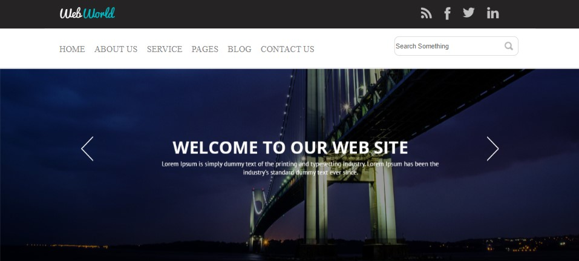
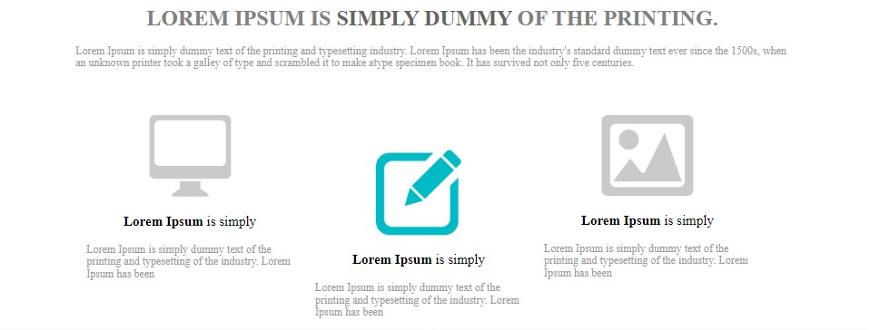
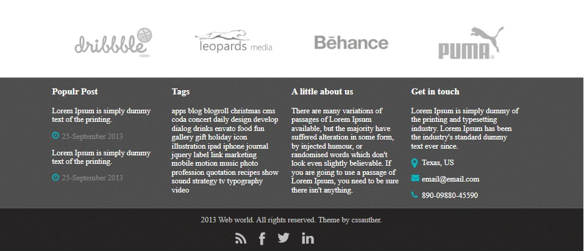

# This is a template web.

# Index

- [Overview](#id01)
- [Technologies](#id02)
- [Photos](#id03)
- [Requirements](#id04)
- [Author](#id05)

## Overview <a name="id01">Web Site Template</a>

This is a web site template web application web to publish gourmet recepies. 
The pages for this application are:

- homepage.

<h3>Visit webpage: </h3><a href="https://web-site-template-37b4eincs-gabicantarini.vercel.app/">Web Site</a>

## Technologies 

I've used the follow technologies: 

<code></code>
<code></code>
<code></code>
<code></code>

## Photos 

Banner: 

Icons: 

Footer: 

# Requirements 

Compiling info: 

 

- [x] Code editor as your preference (I recommend VS Code)
- [x] Git
- [x] Slick
- [ ] Desktop Style
- [ ] Mobile Style

 

# Author 

<a href="https://www.linkedin.com/in/gabrielacantarini/">Gabriela Cantarini</a>